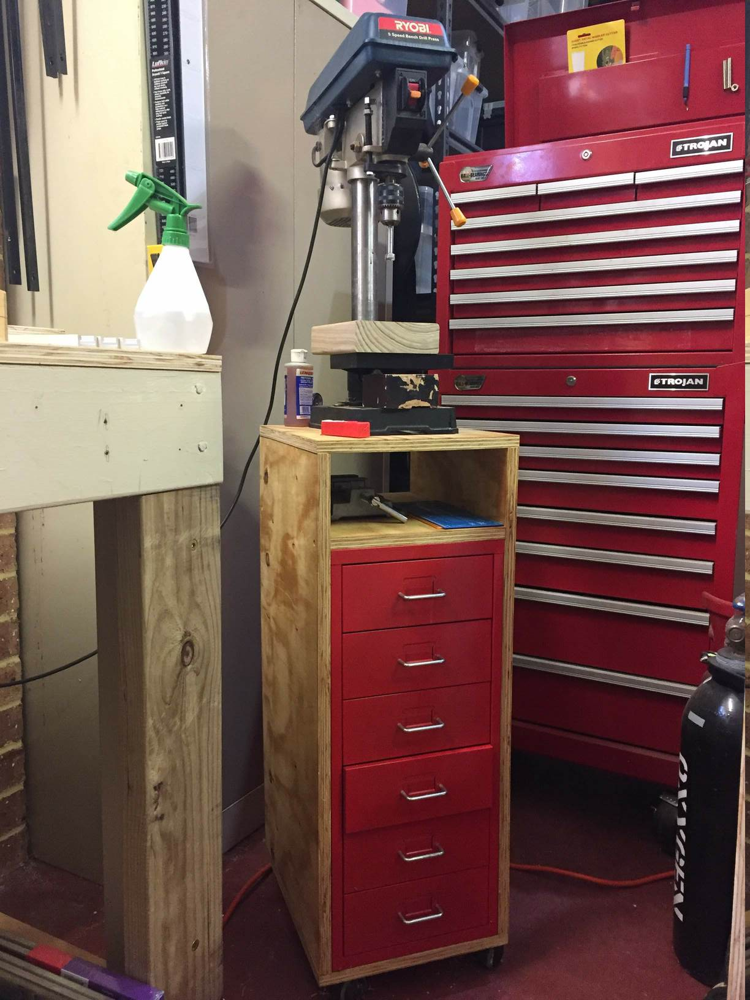
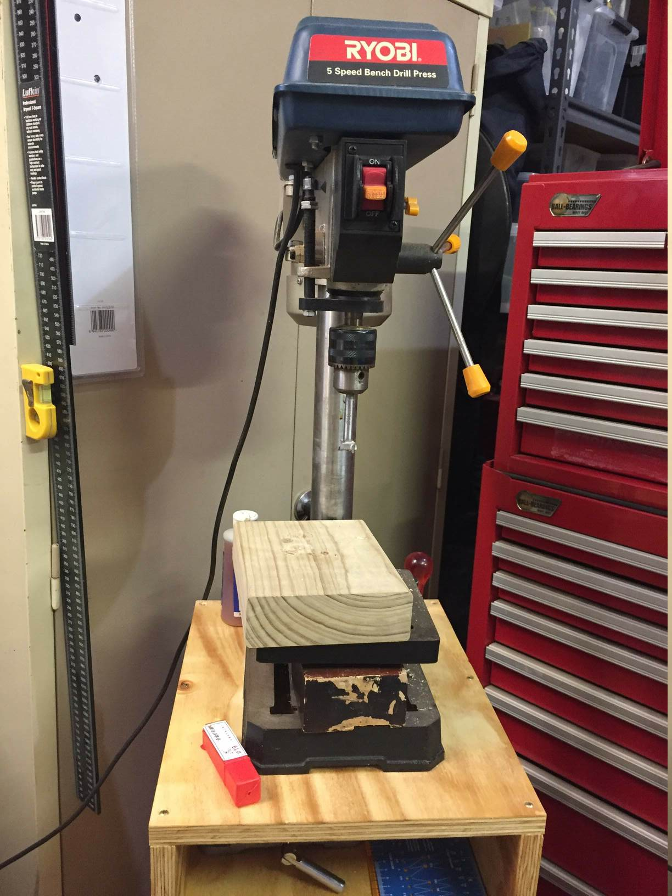
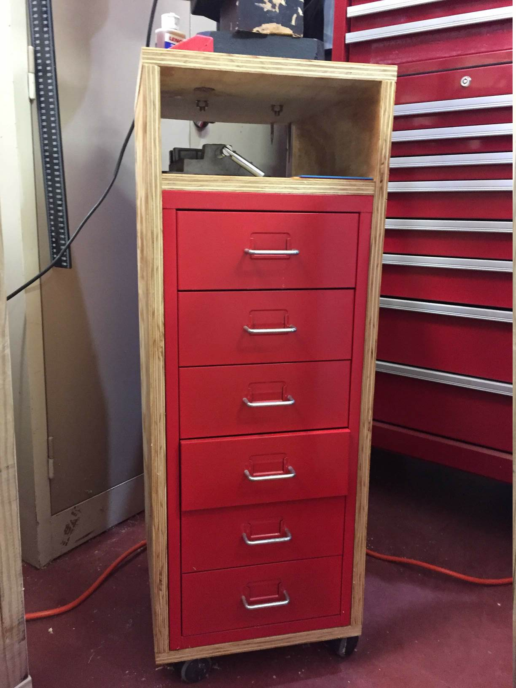
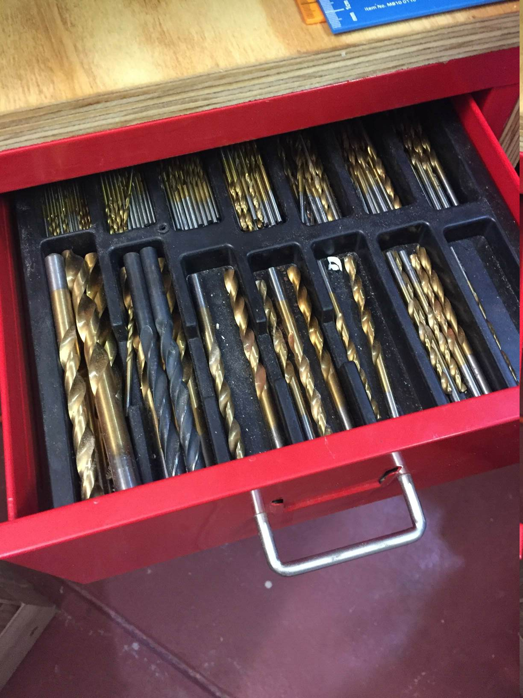
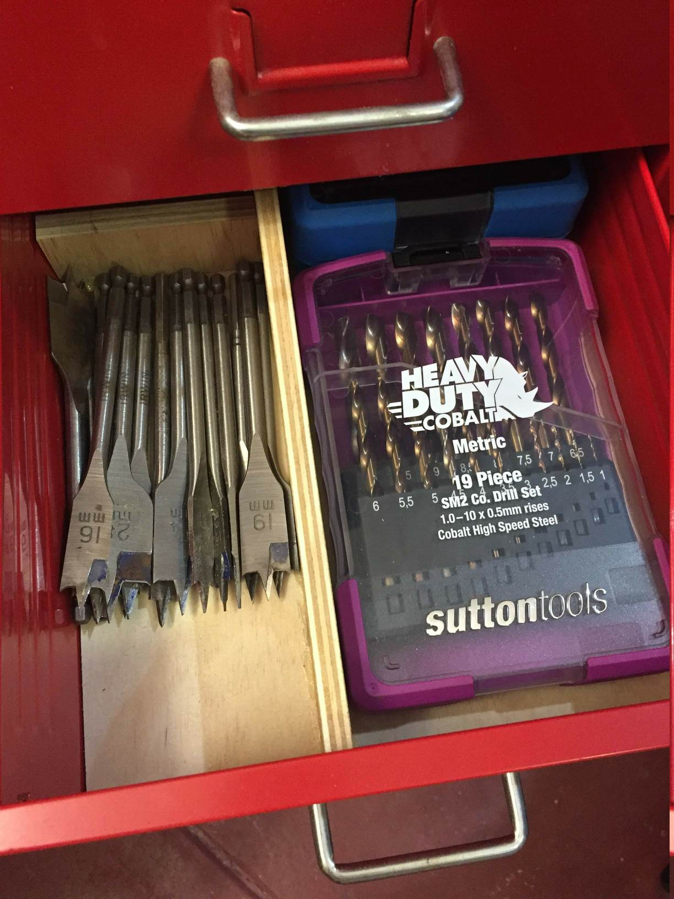
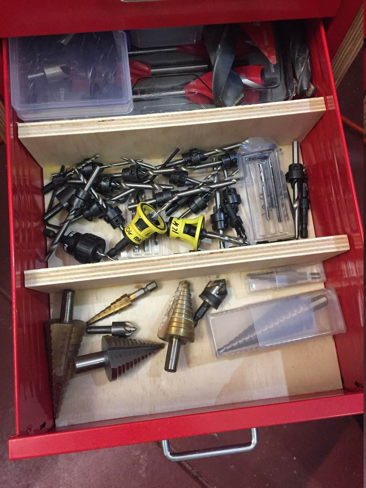
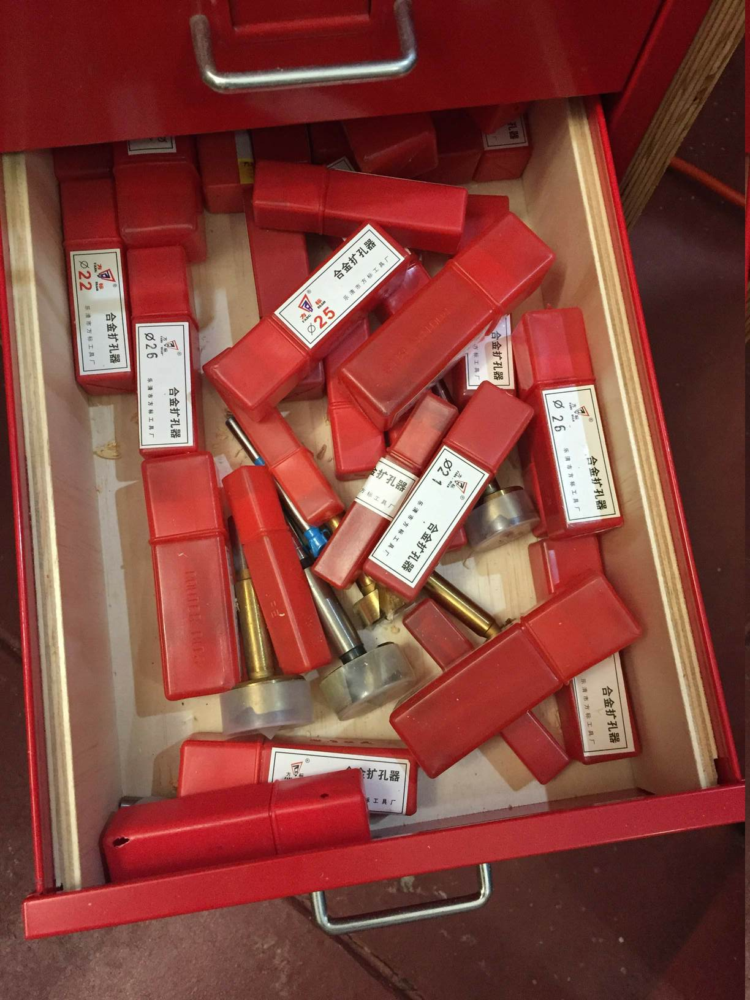
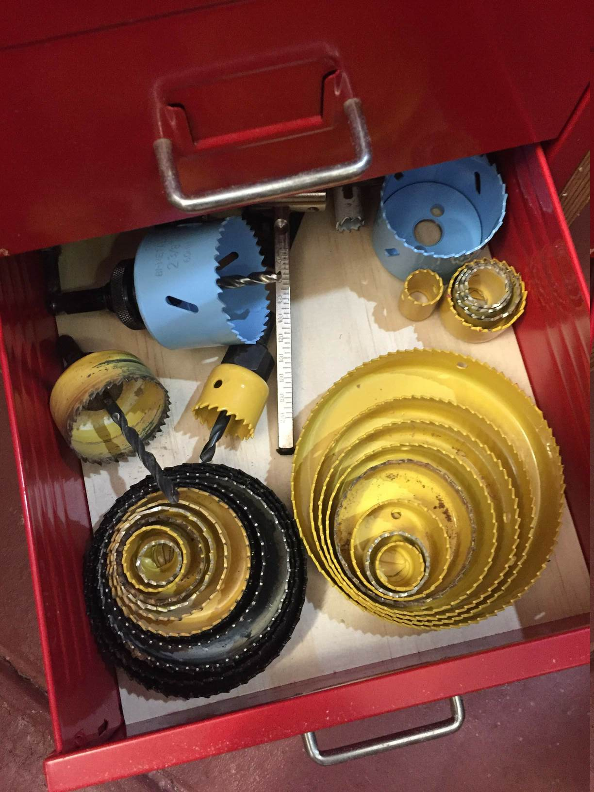

# Bench drill stand

A bench drill stand for my small Ryobi bench-top drill

# Drawers

Bottom drawers are old Ikea office drawers I had. It keeps all the drill bits.
The icea drawers are lined with epoxied 7mm ply to stiffen them up.  ply
partitions are made to keep bits organised.

# Notes

840x320x410mm 19mm ply on 60mm coasters. Glued and screwed. Top of shelf is
140mm from cabinet top.  coated in oil-based polyutherane colouring it too
yellow.
